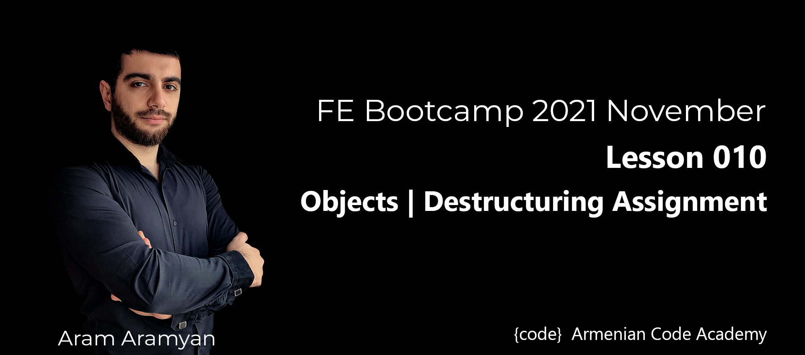

---
# **Objects**

* **Task.**

	```js
	let person = { name: "Sarah", country: "Nigeria", job: "Developer" };

	let name, country, job;

	const { name, country, job } = person;
	console.log(name);
	```

* **Get name, country and jod using destructuring.**

	```js
	let person = { name: "Sarah", country: "Armenia", job: "Developer" };

	console.log(name);    // "Sarah"
	console.log(country); // "Nigeria"
	console.log(job);     // "Developer"
	```
	[**SOLUTION**](1.useDestructuring.js)
	___

* **Concatenate the two arrays.**

	```js
	const arr1 = [1, 2, 3, 4];
	const arr2 = [5, 6, 7, 8, 9];

	const arr3; // [1, 2, 3, 4, 5, 6, 7, 8, 9]
	```
	[**SOLUTION**](2.concatenateArrays.js)
	___

* **How to take arguments in sum function?**
	```js
	function sum() {
		return args.reduce((sum, current) => {
			return sum + current;
		});
	}

	sum(1, 2);    // 3
	sum(1, 2, 3); // 6
	```
	[**SOLUTION**](3.argsInFunc.js)
	___

* **How to pass arguments in sum function?**

	```js
	function sum(x, y, z) {
		return x + y + z;
	}

	const numbers = [1, 2, 3];
	console.log(sum()); // 6
	```
	[**SOLUTION**](4.passArgsToFunc.js)
	___

* **Swapping Values using the Destructuring Assignment.**

	```js
	let a = 3;
	let b = 6;

	console.log(a); //6
	console.log(b); //3
	```
	[**SOLUTION**](5.swappingValues.js)
	___

* **Upvotes and Downvotes.**\
*Given an object containing counts of both upvotes and downvotes, return what vote count should be
displayed. This is calculated by subtracting the number of downvotes from upvotes.*

	```js
	getVoteCount({ upvotes: 13, downvotes: 0 });    // 13
	getVoteCount({ upvotes: 2, downvotes: 33 });    // -31
	getVoteCount({ upvotes: 132, downvotes: 132 }); // 0
	```
	[**SOLUTION**](6.getVoteCount.js)
	___

* **50, 30, 20**\
*The 50-30-20 strategy is a simple way to budget, which involves spending 50% of after-tax income on
needs, 30% after tax income on wants, and 20% after-tax income on savings or paying off debt.
\
\
Given the after-tax income as **ati**, what you are supposed to do is to make a function that will return an
object that shows how much a person needs to spend on needs, wants, and savings.*

	```js
	fiftyThirtyTwenty(10000); // { "Needs": 5000, "Wants": 3000, "Savings": 2000 }

	fiftyThirtyTwenty(50000); // { "Needs": 25000, "Wants": 15000,
	"Savings": 10000 }

	fiftyThirtyTwenty(13450); // { "Needs": 6725, "Wants": 4035, "Savings": 2690 }
	```
	[**SOLUTION**](7.fiftyThirtyTwenty.js)
	___

* **Create a one-liner function**\
*Create a function that takes an object as an argument and returns a string with facts about the city. The city facts will need to be extracted from the object's three properties:*

	```js
	name
	population
	continent
	```
	*The string should have the following format: X has a population of Y and is situated in Z (where X is the city name, Y is the population and Z is the continent the city is situated in).*

	```js
	cityFacts({
		name: "Paris",
		population: "2,140,526",
		continent: "Europe",
	}); // "Paris has a population of 2,140,526 and is situated in Europe"
	
	cityFacts({
		name: "Tokyo",
		population: "13,929,286",
		continent: "Asia",
	}); // "Tokyo has a population of 13,929,286 and is situated in Asia"
	```
	[**SOLUTION**](8.cityFacts.js)
	___

* **Create a function that takes infinite count of elements,operator and prints their sum. If there's no operator, then default should be +.**

	```js
	printSum("*", 1, 2, 3);       // 6
	printSum(1, 2, 3, 4, 5);      // 15
	printSum("-", 1, 2, 3, 6, 7); // -17
	printSum("**", 2, 3, 2);      // 64
	```
	[**SOLUTION**](9.printSum.js)
	___

	# ***Optional Tasks***

* **Make a Circle with methods.**\
*Your task is to create a Circle constructor that creates a circle with a radius provided by an argument. The circles constructed must have two methods getArea() (PIr^2) and getPerimeter() (2PI*r) which give both respective areas and perimeter (circumference).*\
\
For help with this class, I have provided you with a Rectangle constructor which you can use as a base example.

	```js
	let circy = new Circle(11);
	circy.getArea(); // 380.132711084365

	let circy1 = new Circle(4.44);
	circy1.getPerimeter(); // 27.897342763877365
	```
	[**SOLUTION**](optional_1.js)
	___

* **Lowercase and Uppercase.**\
*Write a function that creates an object with each (key, value) pair being the (lower case, upper case) versions of a letter, respectively.*
	```js
	mapping(["p", "s"]); // { "p": "P", "s": "S" }
	mapping(["a", "b", "c"]); // { "a": "A", "b": "B", "c": "C" }
	mapping(["a", "v", "y", "z"]); //{ "a": "A", "v": "V", "y": "Y", "z": "Z" }
	```
	[**SOLUTION**](optional_2.js)
	___

* **Frequency Distribution.**\
*Create a function that returns the frequency distribution of an array. This function should return an object, where the keys are the unique elements and the values are the frequency in which those elements occur.*

	```js
	getFrequencies(["A", "B", "A", "A", "A"]); 
	// { A: 4, B: 1 }
	getFrequencies([1, 2, 3, 3, 2]); 
	// { "1": 1, "2": 2, "3": 2 }
	getFrequencies([true, false, true, false, false]);
	// { true: 2, false: 3 }
	getFrequencies([]); 
	// {}
	```
	[**SOLUTION**](optional_3.js)
	___